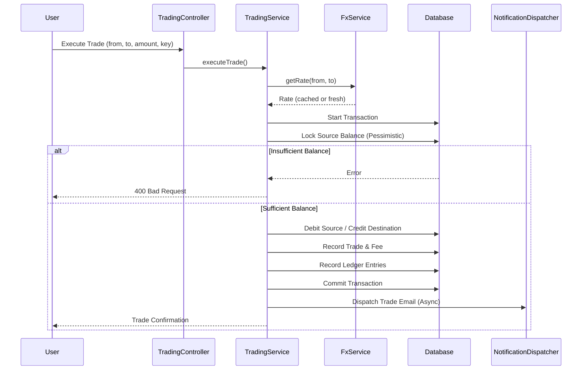

# FX Trading App

A high-performance NestJS-based backend application for foreign exchange (FX) trading and wallet management. This system allows users to fund their accounts, trade between various currency pairs, and manage multi-currency balances with a robust audit trail and asynchronous notifications.

## 🚀 Getting Started

### 1. Prerequisites
- **Node.js** (v18+)
- **Yarn**
- **Docker** and **Docker Compose**
### 2. Running/Starting the App

There are two primary ways to run the FX Trading App for local development and testing:

#### 2.1. Via Yarn (Local Host)

This method runs the application directly on your host machine, requiring you to manage PostgreSQL, Redis, and an SMTP server separately (or ensure they are accessible).

1.  **Configure Environment Variables**: Create a `.env` file in the root directory by copying the example:
    ```bash
    cp env.example .env
    ```
    **Crucially, you must fill in all the correct credentials and connection details** for your local PostgreSQL database, Redis instance, JWT secrets, SMTP server, and any external FX rate API. The app will *not* function correctly without these.

2.  **Install Dependencies**: Install Node.js dependencies:
    ```bash
    yarn install
    ```

3.  **Start the Application**: Launch the NestJS application in development mode:
    ```bash
    yarn start:dev
    ```
    Ensure your PostgreSQL and Redis services are already running and accessible.

#### 2.2. Via Docker Compose (Containerized)

For maximum convenience in testing and development, you can run the entire application stack using Docker Compose. All external services (PostgreSQL, Redis, and an email testing server) are containerized, meaning you don't need to manually configure any `.env` files for these services.

1.  **Install Docker**: Ensure you have Docker and Docker Compose installed on your machine.

2.  **Start the Stack**: Navigate to the project root and run:
    ```bash
    docker-compose up --build -d
    ```
    This command will:
    *   Build the `app` Docker image.
    *   Start all services (PostgreSQL, Redis, MailHog, and the NestJS app) in detached mode.
    *   Automatically run database migrations after PostgreSQL is ready, ensuring your database schema is always up-to-date.
    *   Automatically create persistent volumes for PostgreSQL and Redis data (`pg_data`, `redis_data`) to ensure data is maintained across restarts.

3.  **Access the Application**: Once all containers are up and running, access the application API at:
    `http://localhost:3000`

4.  **View Emails**: Access the MailHog web UI at:
    `http://localhost:8025`
    Here you can view any emails sent by the application locally, such as welcome emails or trade confirmations.

---

### 🧪 Testing Accounts (Seed Data)
The system is pre-seeded with default accounts for development and testing:


| Role | Email | Password | Initial Balance |
| :--- | :--- | :--- | :--- |
| **Admin** | `admin@fx.com` | `Admin@123` | N/A |
| **User** | `user@fx.com` | `User@123` | 1,000 NGN |

*Both accounts are pre-verified (Email & KYC) and ready for immediate use.*

---

## 🛠 Use Cases & User Journeys

After starting the application, you can explore and test the API using the **Swagger Documentation** available at `http://localhost:3000/api/docs`.

### 1. User Onboarding & Authentication
A typical user journey starts with account creation and verification.

1.  **Registration**: Call `POST /iam/users/register` with your email and password.
2.  **OTP Verification**: Upon successful registration, you will receive a 6-digit OTP in your email (check **MailHog** at `http://localhost:8025`).
3.  **Verify Email**: Use the OTP to verify your account by calling `POST /iam/users/verify-email`.
    *   *Note: If the OTP expires or you didn't receive it, call `POST /iam/users/request-new-token` with `purpose: "EMAIL_VERIFICATION"` to get a new one.*
4.  **Login**: Once verified, log in via `POST /iam/users/login` to receive your **Access Token** and **Refresh Token**.
5.  **Authorize**: Copy the `accessToken` from the login response, click the **"Authorize"** button in Swagger, and paste it to access protected endpoints.

### 2. Profile & KYC Management
Before trading, users often need to complete their profile.

1.  **Check Profile**: Call `GET /user-profiles/me` to see your current status.
2.  **Update Profile**: Use `PATCH /user-profiles/me` to update your name, address, or other details.
3.  **KYC Verification (Admin)**: For higher limits, an admin can verify your KYC status using `PATCH /user-profiles/{userId}/kyc` (requires Admin login).

### 3. Wallet Funding
To trade, you must first fund your wallet.

1.  **Check Balances**: Call `GET /wallet/balances` to see your current holdings (e.g., NGN, USD).
2.  **Initialize Funding**: Call `POST /wallet/fund/initialize` with the amount and currency (e.g., 5000 NGN). You will receive a reference.
3.  **Verify Funding**: In a real scenario, this happens after a successful payment callback. Locally, call `POST /wallet/fund/verify` with the reference to complete the deposit.
4.  **Check History**: View your deposits via `GET /wallet/funding-history`.

### 4. FX Trading & Conversions
Once funded, you can convert between supported currencies.

1.  **Check Rates**: Call `GET /fx/rates` to see the current exchange rates and active currency pairs.
2.  **Execute Trade**: Call `POST /trading/execute` to convert funds (e.g., from NGN to USD).
    *   *Note: Use an `idempotencyKey` in the request to ensure the trade isn't processed twice in case of network retries.*
3.  **Trade History**: Review your past conversions via `GET /trading/history`.
4.  **Audit Trail**: Check your transaction ledger at `GET /audit/ledger`.

### 5. Security & Account Recovery
1.  **Forgot Password**:
    *   Request reset: `POST /iam/users/password-reset-request`.
    *   Verify token: `POST /iam/users/verify-password-reset-token` with the OTP from your email.
    *   Reset password: `POST /iam/users/password-reset` with your new password.
2.  **Change Password (Logged In)**:
    *   Initiate: `POST /iam/users/change-password` with your old and new password.
    *   Verify: `POST /iam/users/verify-change-password-token` with the OTP sent to your email.
3.  **Refresh Session**: When your access token expires, use `POST /iam/users/refresh-token` with your `refreshToken` to get a new session without logging in again.

### 6. Administrative Operations (Admin Only)
Admins have oversight and control over the platform's configuration.

1.  **Configure FX**:
    *   Add Currency: `POST /fx/currencies`.
    *   Create Tradeable Pair: `POST /fx/pairs`.
    *   Toggle Pair Status: `PATCH /fx/pairs/{id}/toggle` to enable/disable trading for a pair.
2.  **User Oversight**:
    *   View Profiles: `GET /user-profiles/{userId}`.
    *   Verify Users: `PATCH /user-profiles/{userId}/kyc`.
3.  **System Audit**:
    *   View all system logs: `GET /audit/logs`.

---

## 🏗 Architecture & Design Decisions

### Modular Monolith
The application follows a modular architecture using NestJS, where each domain (IAM, Wallet, Trading, FX, Notification, Audit) is isolated into its own module. This promotes maintainability and allows for easier extraction into microservices if needed.

### Core Workflows

#### 💰 Wallet & Funding
- **Pessimistic Locking:** To prevent race conditions and ensure data integrity during concurrent balance updates (funding/trading), the system uses database-level row locking (`pessimistic_write`).
- **Ledger Entries:** Every movement of funds is backed by a ledger entry in the `Audit` module, providing a non-repudiable history of all transactions.

#### 💱 Trading Logic
- **Atomic Transactions:** Trades involve debiting one currency and crediting another. These operations are wrapped in a single database transaction to ensure atomicity.
- **Idempotency:** Trade execution supports an `idempotencyKey` to prevent duplicate trades due to network retries.
- **Fee Management:** A configurable platform fee is applied to every trade and recorded separately for financial reporting.

#### 📈 FX Rates
- **Provider Abstraction:** The `FxModule` uses an interface for rate providers, allowing the system to switch between different external APIs (e.g., ExchangeRate-API, OANDA) without affecting business logic.
- **Caching Strategy:** Rates are cached in Redis with a configurable TTL (default 1 hour) to reduce external API costs and improve performance.

#### 📧 Asynchronous Notifications
- **BullMQ:** Time-consuming tasks like sending emails are offloaded to background workers using BullMQ and Redis. This ensures that the API remains responsive even during heavy mail loads.

---

## 📉 Assumptions & Limitations

1.  **FX Rates:**
    - Rates are fetched on-demand and cached.
    - The system assumes a mid-market rate is provided by the external API; spreads are currently handled via a flat platform fee (1%).
    - Intersystem trades use the most recently cached rate or fetch a fresh one if expired.
2.  **Wallet Design:**
    - A user has one `Wallet` which contains multiple `WalletBalance` entries (one per currency).
    - Funding is restricted to specific "Funding Currencies" (e.g., USD, EUR) as defined in the database.
3.  **Audit Trail:**
    - Ledger entries are immutable once written.
    - System assumes the database is the single source of truth for all balances.

---

## 📈 Scaling to Millions of Users

To handle millions of users, the following architectural evolutions would be implemented:

1.  **Database Sharding:** Shard the `WalletBalance` and `Ledger` tables by `userId` to distribute write load across multiple database instances.
2.  **Read Replicas:** Implement read-write splitting, directing heavy GET requests (e.g., trade history, balance checks) to read replicas.
3.  **Microservices Transition:**
    - **IAM Service:** Separate authentication and user management.
    - **Trade Engine:** A dedicated, high-performance service (potentially in Rust or Go) to handle order matching and execution.
    - **Wallet Service:** A specialized service for ledger management with high-throughput consistency.
4.  **Event-Driven Architecture:** Use a message broker like **Apache Kafka** for inter-service communication and to feed the audit/analytics pipelines.
5.  **Distributed Caching:** Use a clustered Redis setup for session management and real-time rate distribution.
6.  **Rate Limiting & Throttling:** Implement global rate limiting at the API Gateway level to protect downstream services from spikes.

---

## 🗺 System Flows

### Trading Execution Flow


---

## 🧪 Testing
- **Unit Tests:** `yarn test`
- **E2E Tests:** `yarn test:e2e`
- **Linting:** `yarn lint`
